# BiHyPE: Binary-based Hybrid Positional Encoding for Time-series Analysis

Official PyTorch implementation of **BiHyPE (Binary-based Hybrid Positional Encoding)** across four core time-series analysis tasks: 
- **Time-series Anomaly Detection (TSAD)**
- **Time-series Forecasting (TSF)**
- **Time-series Classification (TSC)**
- **Time-series Imputation (TSI)**.

---

## 🛠️ Benchmark Baselines

Summary of baseline models, their official source repositories, and their corresponding task domains evaluated with **BiHyPE**:

| Task Type | Task Abbreviation | Baseline Model | Official Source Code |
| :--- | :--- | :--- | :--- |
| Anomaly Detection | **TSAD** | Anomaly Transformer | [BiHyPE/AnomalyTransformer](https://github.com/BiHyPE-TimeSeriesAnalysis/bihype-tsad-anomaly-transformer) |
| Anomaly Detection | **TSAD** | MEMTO | [BiHyPE/MEMTO](https://github.com/BiHyPE-TimeSeriesAnalysis/bihype-tsad-memto) |
| Anomaly Detection | **TSAD** | AnomalyBERT | [BiHyPE/AnomalyBERT](https://github.com/BiHyPE-TimeSeriesAnalysis/bihype-tsad-anomalybert) |
| Anomaly Detection | **TSAD** | RESTAD (R) | [BiHyPE/RESTAD(R)](https://github.com/BiHyPE-TimeSeriesAnalysis/bihype-tsad-restad) |
| Anomaly Detection | **TSAD** | RESTAD (K) | [BiHyPE/RESTAD(K)](https://github.com/BiHyPE-TimeSeriesAnalysis/bihype-tsad-restad) |
| Forecasting | **TSF** | Autoformer | [BiHyPE/Autoformer](https://github.com/BiHyPE-TimeSeriesAnalysis/bihype-tsf-autoformer-informer-reformer) |
| Forecasting | **TSF** | Informer | [BiHyPE/Informer](https://github.com/BiHyPE-TimeSeriesAnalysis/bihype-tsf-autoformer-informer-reformer) |
| Forecasting | **TSF** | Reformer | [BiHyPE/Reformer](https://github.com/BiHyPE-TimeSeriesAnalysis/bihype-tsf-autoformer-informer-reformer) |
| Classification | **TSC** | ConvTran | [BiHyPE/ConvTran](https://github.com/BiHyPE-TimeSeriesAnalysis/bihype-tsc-convtran) |
| Classification | **TSC** | Gated Transformer Network | [BiHyPE/GTN](https://github.com/BiHyPE-TimeSeriesAnalysis/bihype-tsc-gtn) |
| Imputation | **TSI** | CSDI | [BiHyPE/CSDI](https://github.com/BiHyPE-TimeSeriesAnalysis/bihype-tsi-csdi) |

---

## 📊 Datasets & Resources

All datasets are pre-processed and categorized. You can access the complete dataset packages via the task-specific Google Drive links below:

| Task Domain | Included Datasets | Dataset Preprocessor / Origin Paper | Data Download Link |
| :--- | :--- | :--- | :--- |
| **Time-series Anomaly Detection (TSAD)** | MSL, PSM, SMAP, SWaT, SMD | Xu et al. (*Anomaly Transformer*, NeurIPS 2021) | [Google Drive - TSAD Datasets](https://drive.google.com/drive/folders/1PKHJIi2--liygyXCXiGmgj_RBbDtz6DD?usp=drive_link) |
| **Time-series Forecasting (TSF)** | Weather, ECL, ETTm1, Exchange, Traffic | Wu et al. (*Autoformer*, NeurIPS 2021) | [Google Drive - TSF Datasets](https://drive.google.com/drive/folders/19A8iSs74MszDLCXE7d9dDVp-Ih5PULj7?usp=drive_link) |
| **Time-series Classification (TSC)** | JapaneseVowels, Libras | Foumani, Navid Mohammadi, et al. (*ConvTran*) / Liu, Minghao, et al. (*GTN*)  | [Google Drive - TSC Datasets](https://drive.google.com/drive/folders/1kQXlX2C_Bp9Zy9r5UI1M37umWT4VIpLp?usp=sharing) |
| **Time-series Imputation (TSI)** | PhysioNet 2012, Electricity, PM25 | Tashiro, Yusuke, et al. (*CSDI*, Advances in neural information processing systems 34, 2021) | [Google Drive - TSI Datasets](https://drive.google.com/drive/folders/1fHAQ3iM61IFEkoW1b_aL82qmmN7oldhj?usp=drive_link) |
---
### 🔍 Benchmark Dataset Specifications
* **BiHyPE Core Implementation:** Source code for our proposed positional encoding architecture is available at [`bihype.py`](./bihype.py).

#### Time-series Anomaly Detection (TSAD) Datasets

  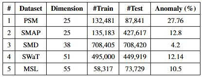

#### Time-series Forecasting (TSF) Datasets

  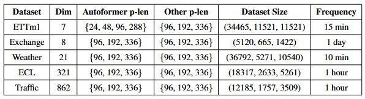

#### Time-series Classification (TSC) Datasets

  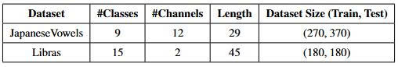

#### Time-series Imputation (TSI) Datasets

  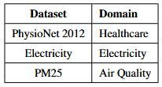

---

In addition, the detailed summary of the 18 classification benchmarks evaluated for extensive Positional Encoding (PE) comparison is illustrated below:

  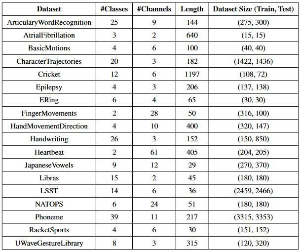

## 📈 Experimental Results

### 1. Time-series Anomaly Detection (TSAD)

#### MSL Dataset

  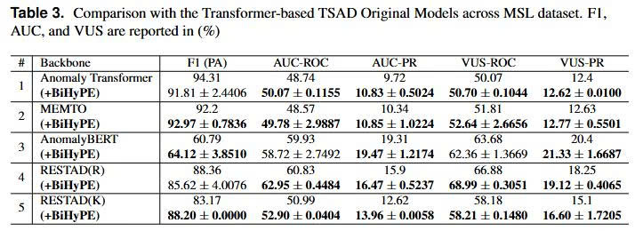

#### PSM Dataset

  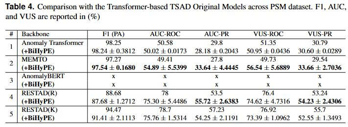

#### SMAP Dataset

  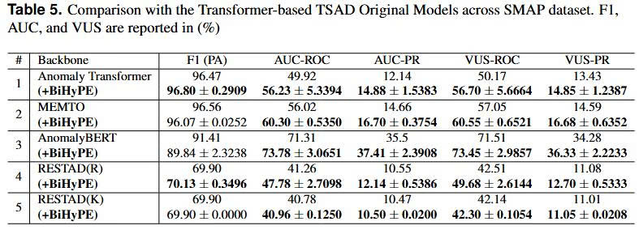

#### SWaT Dataset

  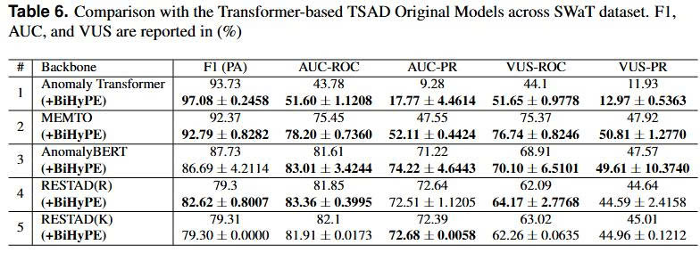

#### SMD Dataset

  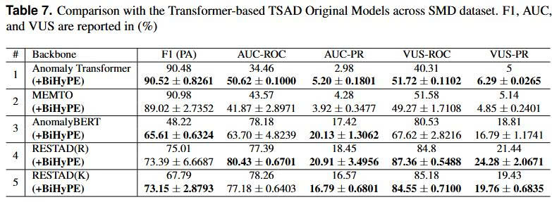

#### Positional Encoding Comparison vs. Non-Transformer Models (MSL)

  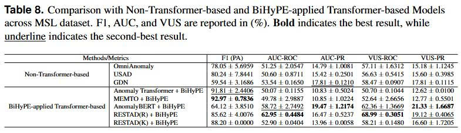

#### Positional Encoding Comparison vs. Non-Transformer Models (SMAP)

  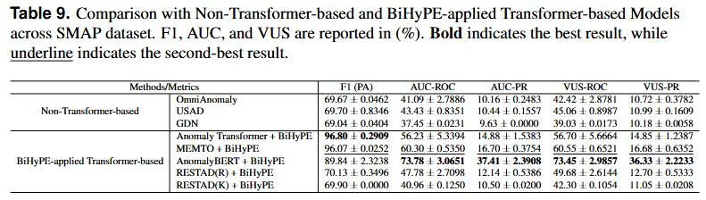

---

### 2. Time-series Forecasting (TSF)

#### Weather Dataset

  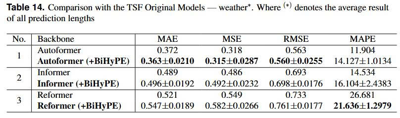

#### ECL Dataset

  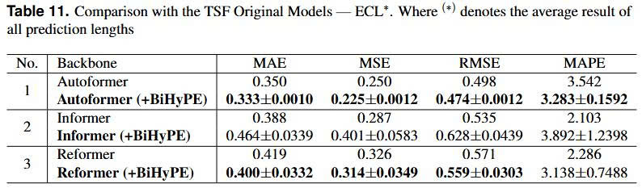

#### ETTm1 Dataset

  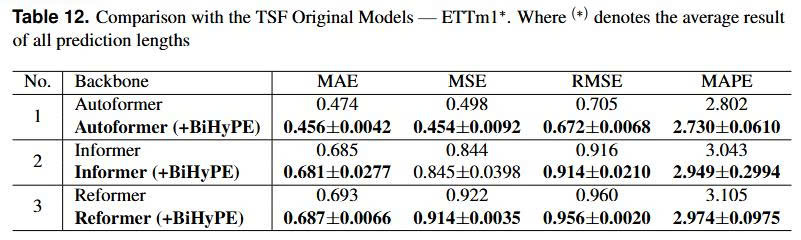

#### Exchange Dataset

  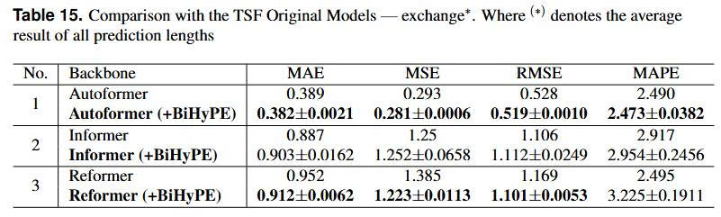

#### Traffic Dataset

  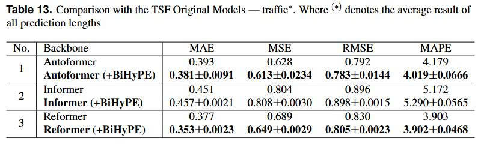

---

### 3. Time-series Classification (TSC)

#### 3.1. General Classification Benchmarks
Benchmark performance across 2 classification datasets (**JapaneseVowels** and **Libras**):

  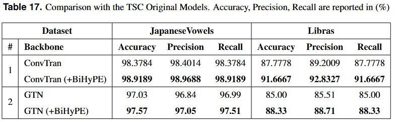

#### 3.2. Comparison with Existing Positional Encoding Scenarios

##### Comparison with tAPE, eRPE, and ConvTran (tAPE + eRPE)

  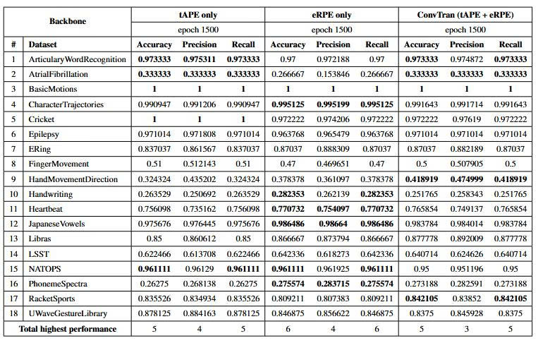

##### Comparison with LAPE, LRPE, and BiHyPE

  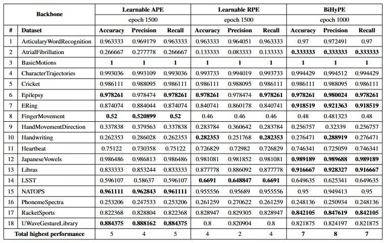

### 4. Time-series Imputation (TSI)

Reconstruction performance across 3 imputation datasets (**PhysioNet 2012**, **Electricity**, and **PM25**):

  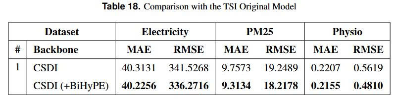

